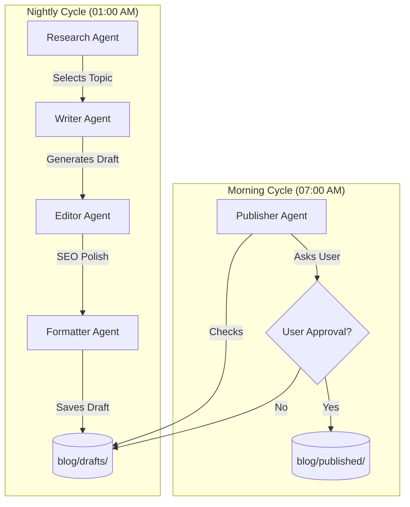

# NightWriter AI: System Architecture & Implementation

## 🏗️ System Architecture

NightWriter AI is designed as a **decoupled multi-agent system**. Each agent is a specialized unit responsible for a single stage of the content pipeline.



### Component Breakdown
1. **Research Agent**: Scrapes headlines from the web. It uses an LLM to evaluate which headline has the highest potential for engagement.
2. **Writer Agent**: Orchestrates a 1000+ word deep-dive into the chosen topic, ensuring clear sections and bullet points.
3. **Editor Agent**: Acting as a senior editor, it scans the draft for grammatical errors and ensures SEO keywords are appropriately placed.
4. **Formatter Agent**: Standardizes the output to Markdown, adding frontmatter (title, date) and saving it with a safe filename.
5. **Publisher Agent**: The interface layer. It monitors the filesystem and handles the transition from "Draft" to "Published" based on human input.

---

## 🛠️ Step-by-Step Implementation Guide

### 1. Environment Setup
We use `python-dotenv` to manage the OpenAI API Key safely. Ensure you never commit your `.env` file to version control.

### 2. The Logic Flow
The `scheduler/night_job.py` is the workflow engine. Instead of putting all logic in one file, we import modular agents to keep code clean and testable.

### 3. Scheduling vs Triggering
We use the `schedule` library for production use, but we've added `test-night` and `test-morning` flags in `main.py` so you can verify the logic instantly.

---

## 📝 Example Generated Blog (Preview)

Below is an example of what the system might generate in `blog/drafts/The_Future_of_AI_Agents_2024.md`:

```markdown
# The Rise of Autonomous AI Agents: Transforming the Future of Work

## Introduction
The digital landscape is evolving faster than ever. No longer are we just talking about chatbots; we are entering the era of **Autonomous AI Agents**. These are systems capable of planning, researching, and executing tasks with minimal human intervention.

## Why Agents are Different
Unlike traditional LLMs that just "answer," agents:
*   **Set Goals**: They understand the objective, not just the prompt.
*   **Use Tools**: They can browse the web, write files, and run code.
*   **Self-Correct**: They review their own work (just like our Editor Agent).

## The Impact on Content Creation
Imagine a system that operates while you sleep... (1000+ words of SEO optimized content here)

## Conclusion
The future is not just about human-AI collaboration; it's about human-led autonomous systems.
```

---

## 🚀 Commands to Run
1. `pip install -r requirements.txt`
2. `python main.py test-night` (To generate your first draft)
3. `python main.py test-morning` (To approve and "publish" it)
